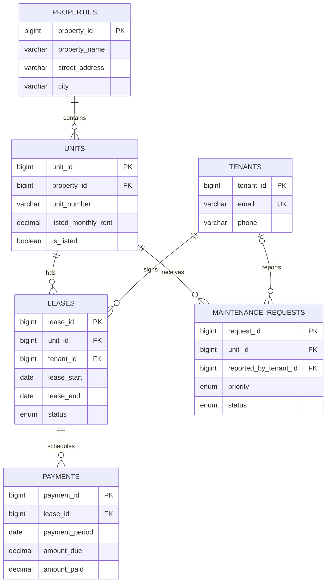

# Apartment Rental System

[](https://www.mysql.com/)
[](sql/001_schema.sql)

**Apartment Rental System** is a MySQL database project for managing residential properties, units, tenants, lease agreements, rent payments, and maintenance work. It converts a previously empty repository into a runnable relational-database portfolio project with an explicit data model and operational reporting queries.

> **Design goal.** The schema is written as a small, realistic foundation for a property-management application. It prioritizes data integrity, queryability, and clear ownership relationships over unnecessary complexity.

## What it demonstrates

| Area | Evidence in the repository |
| --- | --- |
| Relational modeling | Normalized entities for properties, units, tenants, leases, payments, and maintenance requests. |
| Data integrity | Primary keys, foreign keys, unique constraints, check constraints, and indexed access paths. |
| Operational reporting | Queries for availability, active tenancy, receivables, collections, lease expirations, and maintenance work. |
| Derived data | A view derives unit availability from active leases and open maintenance tickets instead of persisting a drift-prone status field. |
| Reproducibility | Separate schema, fictional sample data, and reporting-query scripts. |

## Data model



## Repository structure

```text
sql/
├── 001_schema.sql            # Database, tables, constraints, indexes, and availability view
├── 002_sample_data.sql       # Clearly fictional local-development data
└── 003_reporting_queries.sql # Six practical management and reporting queries
```

## Run locally

Install MySQL 8.0 or later, clone this repository, then execute the scripts in order. The schema file is safe to re-run during local development because it does not drop tables or data.

```bash
mysql -u root -p < sql/001_schema.sql
mysql -u root -p < sql/002_sample_data.sql
mysql -u root -p < sql/003_reporting_queries.sql
```

The final command returns results for each documented query. The sample data uses `.example.test` addresses and clearly fictional property descriptions; it exists only to make the reporting queries reproducible.

## Key design decisions

### Availability is derived, not duplicated

`vw_unit_availability` determines whether a unit is **occupied**, **available**, **under maintenance review**, or **off market** by examining active leases, open maintenance tickets, and the listing flag. This avoids maintaining a separate availability column that could become inconsistent when a lease changes.

### Lease terms preserve historical accuracy

The monthly rent is stored on both the unit listing and the lease. A unit's listed rent can change for future tenants without rewriting the agreed rent of a historic or active lease.

### Payments are period-based

`payments` has a unique `(lease_id, payment_period)` constraint. This makes rent collection and outstanding-balance queries predictable while still allowing partial payment through separate `amount_due` and `amount_paid` fields.

### Constraints reflect business rules

The schema rejects invalid dates, non-positive rent, negative payment amounts, duplicate unit numbers within a property, duplicate tenant emails, and resolved maintenance tickets without a resolution timestamp.

## Example reports

The reporting script includes the following portfolio-ready queries:

| Query | Business question answered |
| --- | --- |
| Available units | Which listed units can be marketed now? |
| Active tenancy register | Who occupies each active unit and when does the lease end? |
| Receivables | Which rent periods are unpaid or partially paid, and by how much? |
| Monthly collections | How much was billed, collected, and remains outstanding by property and month? |
| Expiring leases | Which tenants require renewal outreach within the next 60 days? |
| Maintenance queue | Which open tickets should be prioritized? |

## Extension ideas

The current database focuses on core property operations. Logical next steps would be role-based users, payment transaction history, lease-document storage, tenant communications, scheduled rent reminders, or an API/dashboard built on top of this schema.

## License

No license has been selected yet. Choose an explicit license before opening the project to outside contributions.
